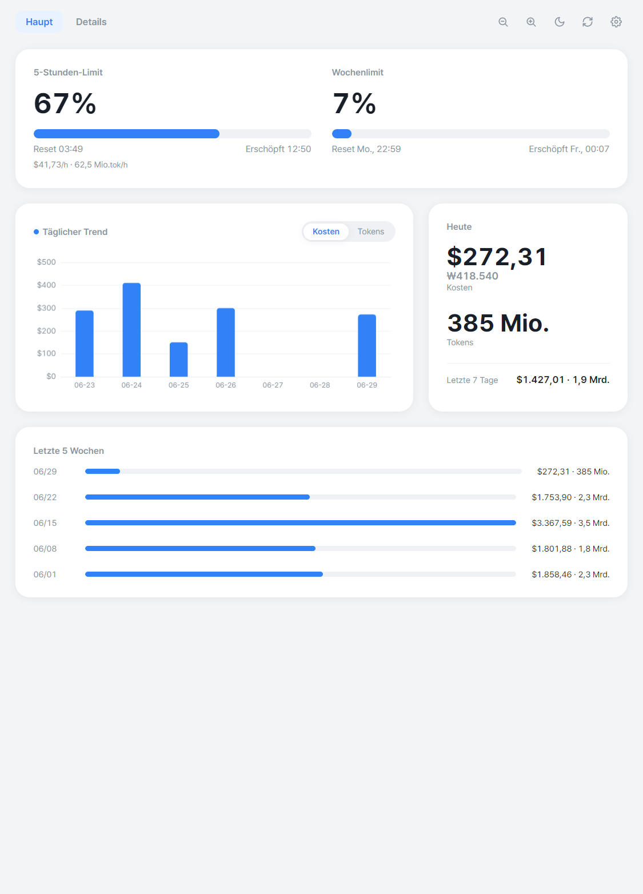
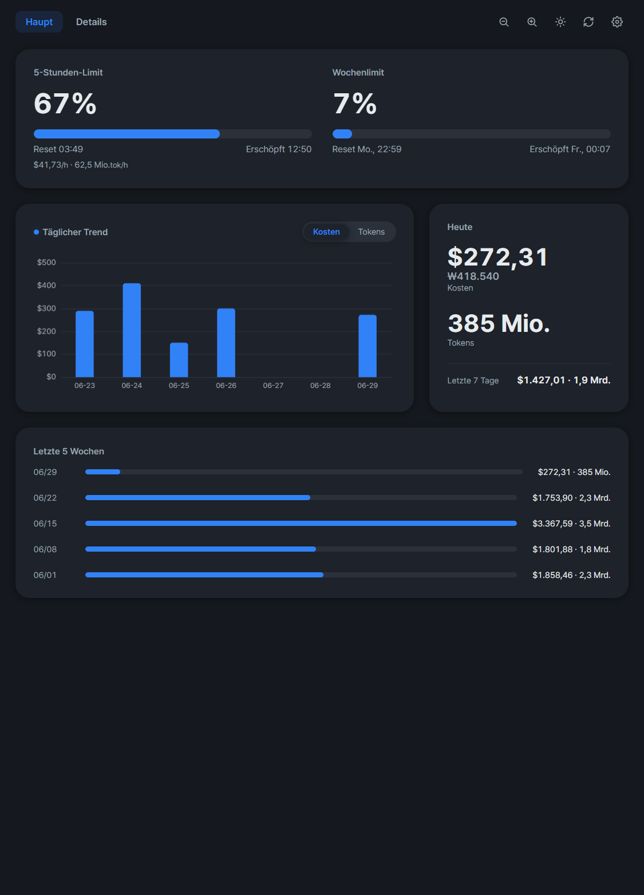
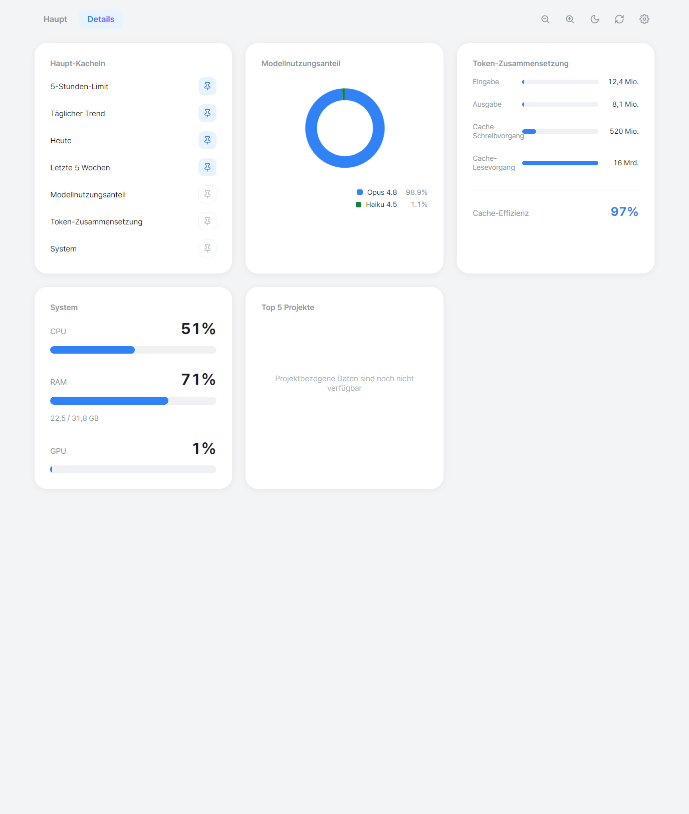
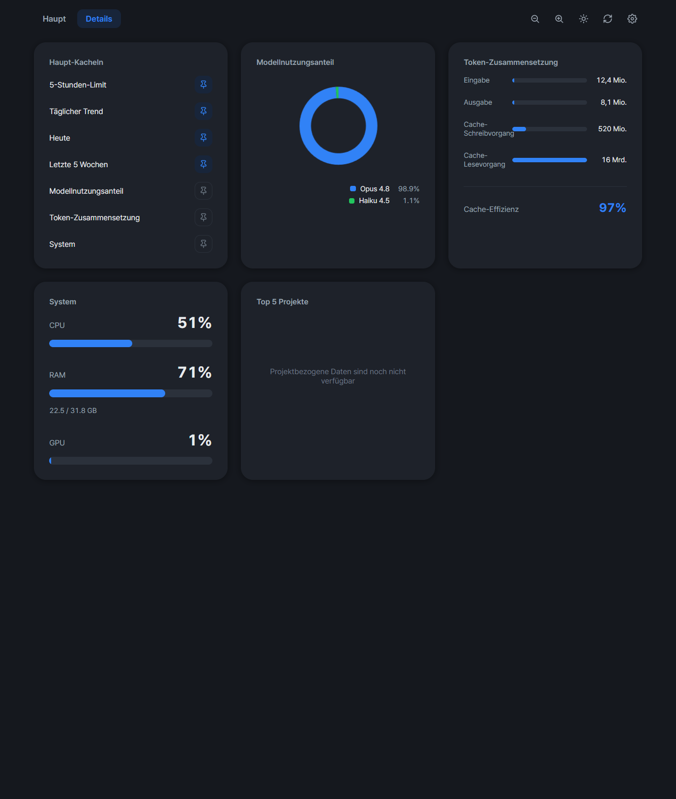
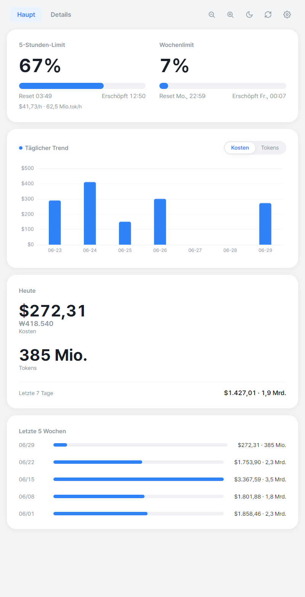

<!-- de -->
[English](../README.md) | [한국어](README.ko.md) | [Español](README.es.md) | [Português](README.pt-BR.md) | [日本語](README.ja.md) | [Deutsch](README.de.md) | [Français](README.fr.md) | [中文](README.zh-CN.md) | [Italiano](README.it.md) | [Tiếng Việt](README.vi.md)

# Claude Usage

Eine native, im Tray laufende Desktop-App, die **deine [ccusage](https://github.com/ryoppippi/ccusage)-Daten in Echtzeit visualisiert** und **automatisch einen monatlichen PDF-Bericht erstellt**.

Mit Electron + ECharts gebaut. Rechnerübergreifend und eigenständig – kein Node, ccusage oder Schriftarten auf dem Zielrechner vorzuinstallieren.

<p align="center">
  
</p>

<details>
<summary>Weitere Screenshots — Dark Theme, Details, responsives Layout</summary>

<table>
  <tr>
    <td width="50%"></td>
    <td width="50%"></td>
  </tr>
  <tr>
    <td width="50%"></td>
    <td width="50%"></td>
  </tr>
</table>

</details>

## Funktionen

- **Live-Dashboard** (helles UI im Toss-Stil): Burn-Anzeige des aktiven 5-Stunden-Blocks ($/h und Tokens/h), täglicher Kosten-/Token-Trend, Modell-Donut, heutige KPIs und Top-Projekte.
- **Monatlicher PDF-Bericht** (4 Seiten): Deckblatt + Zusammenfassung, Tagestrend, Aufschlüsselung (Modelle, Token-Zusammensetzung, Cache-Effizienz), Projekte & Sitzungen.
- **Kosten und Tokens sind überall gleichrangig**; USD wird mit KRW daneben angezeigt (`$X (₩Y)`).
- **Im Tray residierend** mit Autostart; der Bericht wird am 1. jedes Monats erstellt, mit einem Catch-up beim Start.
- **i18n**: Oberfläche in 10 Sprachen, automatisch nach Systemsprache. PDF-Bericht auf Englisch oder Koreanisch.

## Installation

Lade die neueste Version für deine Plattform von der [Releases](https://github.com/gyeongminn/claude-usage/releases)-Seite herunter:

- **Windows**: `ClaudeUsage-<version>-win-x64-setup.exe` (Installer) oder `...-portable.exe` (ohne Installation). Stille Installation: `ClaudeUsage-...-setup.exe /S`.
- **macOS**: `ClaudeUsage-<version>-mac-<arch>.dmg` oder `.zip`.

### Aus dem Quellcode ausführen

```sh
npm install
npm start
```

## Entwicklung

```sh
npm test
npm start
npm run shot
```

### Build & Release

```sh
npm run build
npm run release:patch
```

## Datenquelle

Alle Nutzungszahlen stammen aus der [ccusage](https://github.com/ryoppippi/ccusage)-CLI, die `~/.claude/projects/**/*.jsonl` (oder `CLAUDE_CONFIG_DIR`) liest. Die Preise stammen von ccusage; KRW-Werte werden aus USD mit einem Live-Wechselkurs (mit Offline-Fallback) umgerechnet. Diese App visualisiert und berichtet nur – sie implementiert die Aggregation von ccusage nicht neu.

## Lizenz

[MIT](../LICENSE) © gyeongmin
