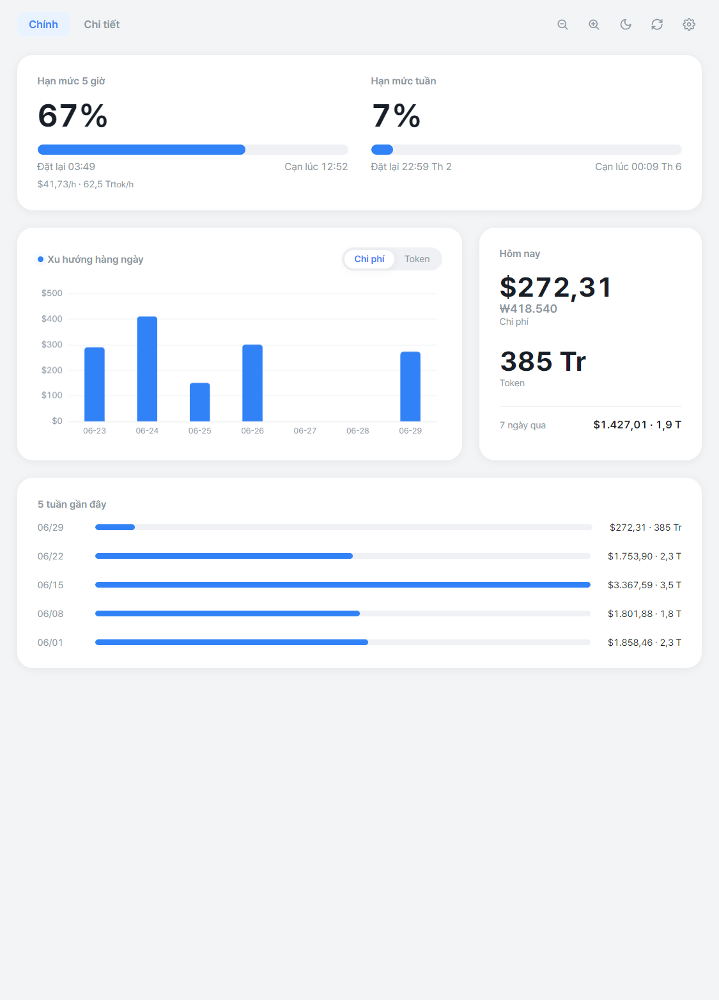
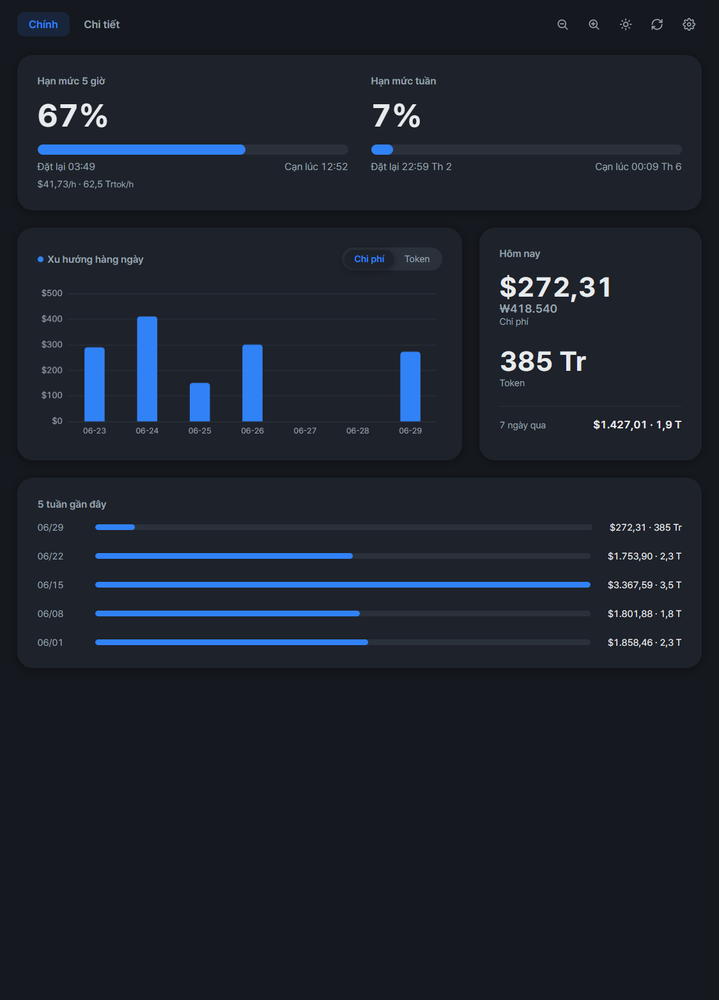
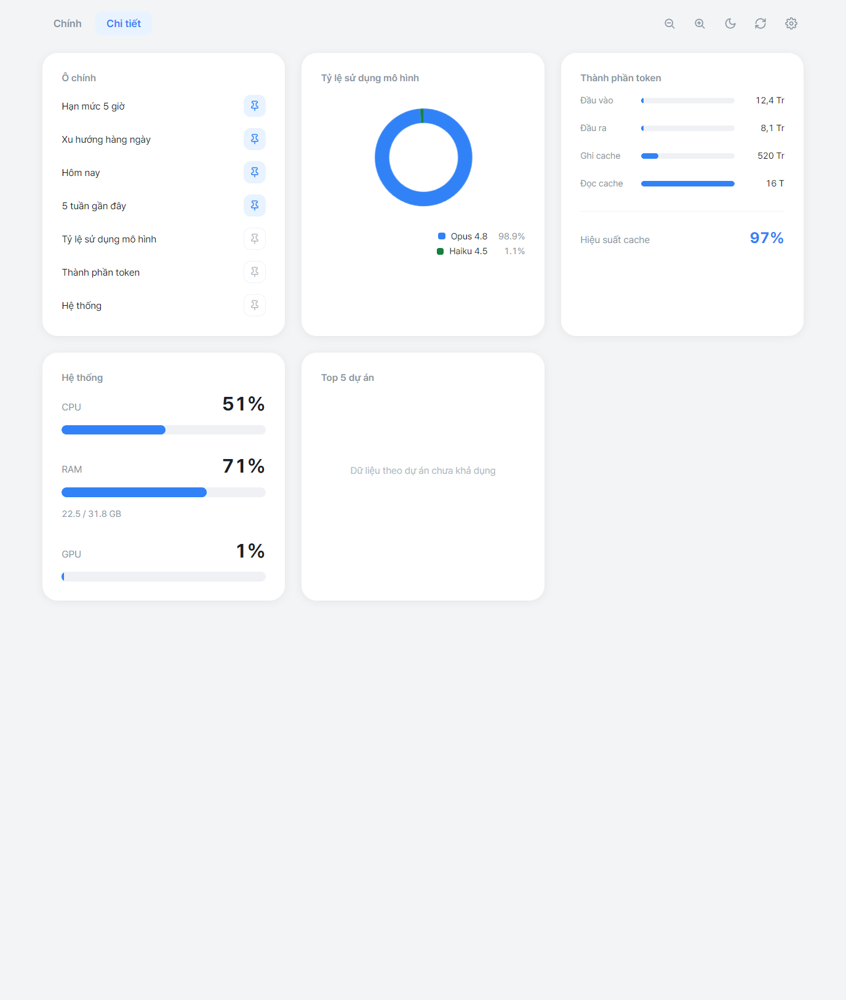
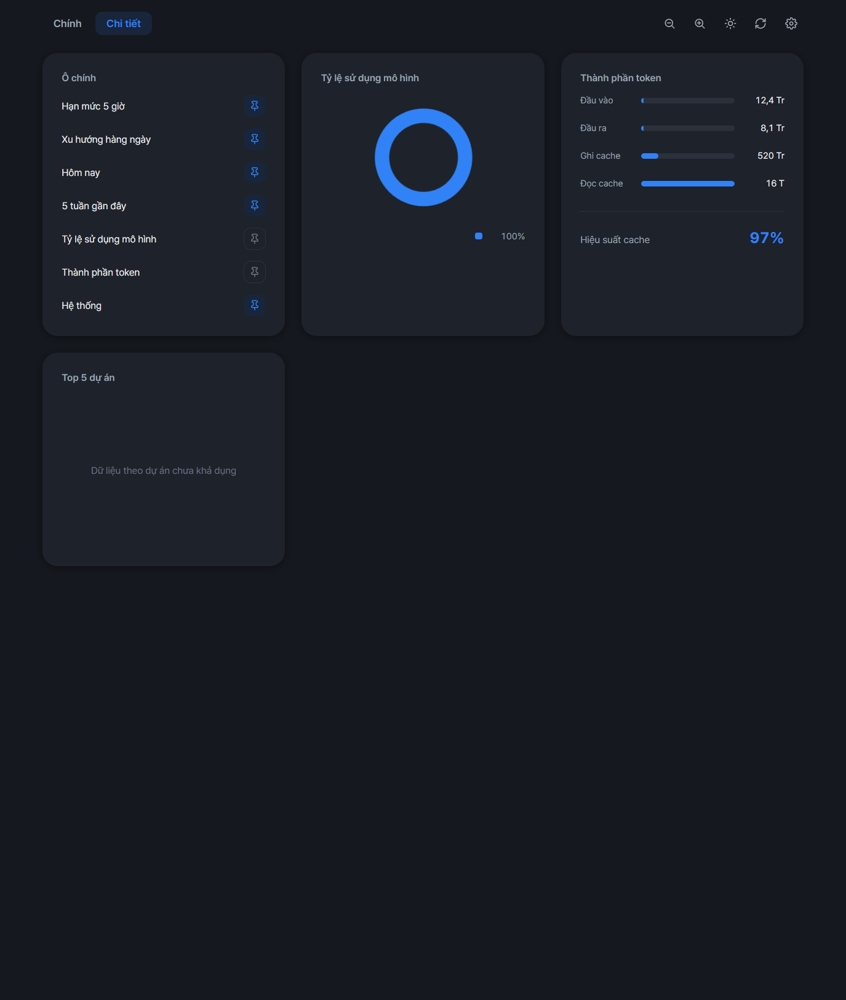
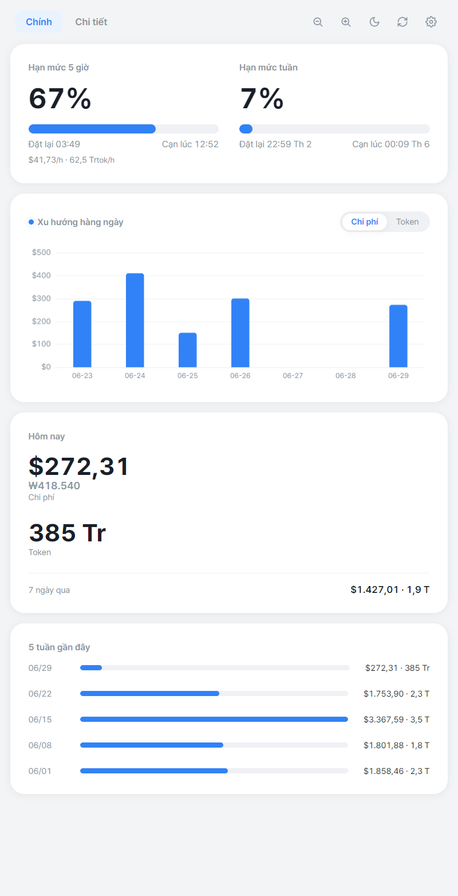

<!-- vi -->
[English](../README.md) | [한국어](README.ko.md) | [Español](README.es.md) | [Português](README.pt-BR.md) | [日本語](README.ja.md) | [Deutsch](README.de.md) | [Français](README.fr.md) | [中文](README.zh-CN.md) | [Italiano](README.it.md) | [Tiếng Việt](README.vi.md)

# Claude Usage

Ứng dụng desktop gốc, thường trú ở khay hệ thống, **trực quan hóa dữ liệu [ccusage](https://github.com/ryoppippi/ccusage) của bạn theo thời gian thực** và **tự động tạo báo cáo PDF hằng tháng**.

Xây dựng bằng Electron + ECharts. Đa máy và tự chứa — không cần cài sẵn Node, ccusage hay phông chữ trên máy đích.

<p align="center">
  
</p>

<details>
<summary>Thêm ảnh chụp màn hình — giao diện tối, chi tiết, bố cục responsive</summary>

<table>
  <tr>
    <td width="50%"></td>
    <td width="50%"></td>
  </tr>
  <tr>
    <td width="50%"></td>
    <td width="50%"></td>
  </tr>
</table>

</details>

## Tính năng

- **Bảng điều khiển trực tiếp** (UI sáng kiểu Toss): đồng hồ tiêu hao của khối 5 giờ đang hoạt động ($/h và token/h), xu hướng chi phí/token hằng ngày, biểu đồ vòng theo mô hình, KPI hôm nay và dự án hàng đầu.
- **Báo cáo PDF hằng tháng** (4 trang): trang bìa + tóm tắt, xu hướng hằng ngày, phân tích (mô hình, thành phần token, hiệu quả cache), dự án và phiên.
- **Chi phí và token ngang hàng** ở mọi nơi; USD hiển thị kèm KRW (`$X (₩Y)`).
- **Thường trú ở khay** với tự khởi động cùng đăng nhập; báo cáo được tạo vào ngày 1 mỗi tháng, có cơ chế bù khi khởi động.
- **i18n**: giao diện 10 ngôn ngữ, tự áp dụng theo ngôn ngữ hệ thống. Báo cáo PDF bằng tiếng Anh hoặc tiếng Hàn.

## Cài đặt

Tải bản phát hành mới nhất cho nền tảng của bạn từ trang [Releases](https://github.com/gyeongminn/claude-usage/releases):

- **Windows**: `ClaudeUsage-<version>-win-x64-setup.exe` (trình cài đặt) hoặc `...-portable.exe` (không cần cài). Cài đặt im lặng: `ClaudeUsage-...-setup.exe /S`.
- **macOS**: `ClaudeUsage-<version>-mac-<arch>.dmg` hoặc `.zip`.

### Chạy từ mã nguồn

```sh
npm install
npm start
```

## Phát triển

```sh
npm test
npm start
npm run shot
```

### Build và phát hành

```sh
npm run build
npm run release:patch
```

## Nguồn dữ liệu

Mọi số liệu sử dụng đến từ CLI [ccusage](https://github.com/ryoppippi/ccusage), đọc `~/.claude/projects/**/*.jsonl` (hoặc `CLAUDE_CONFIG_DIR`). Giá lấy từ ccusage; giá trị KRW được quy đổi từ USD theo tỷ giá trực tiếp (có dự phòng ngoại tuyến). Ứng dụng này chỉ trực quan hóa và báo cáo; không tái hiện phần tổng hợp của ccusage.

## Giấy phép

[MIT](../LICENSE) © gyeongmin
