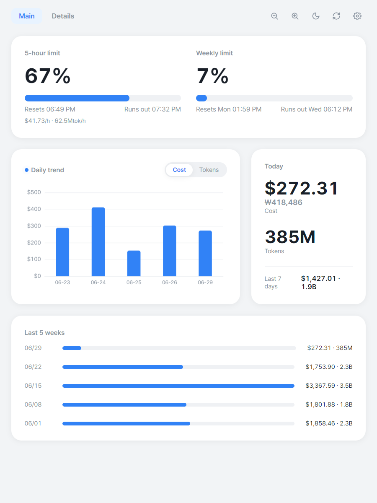
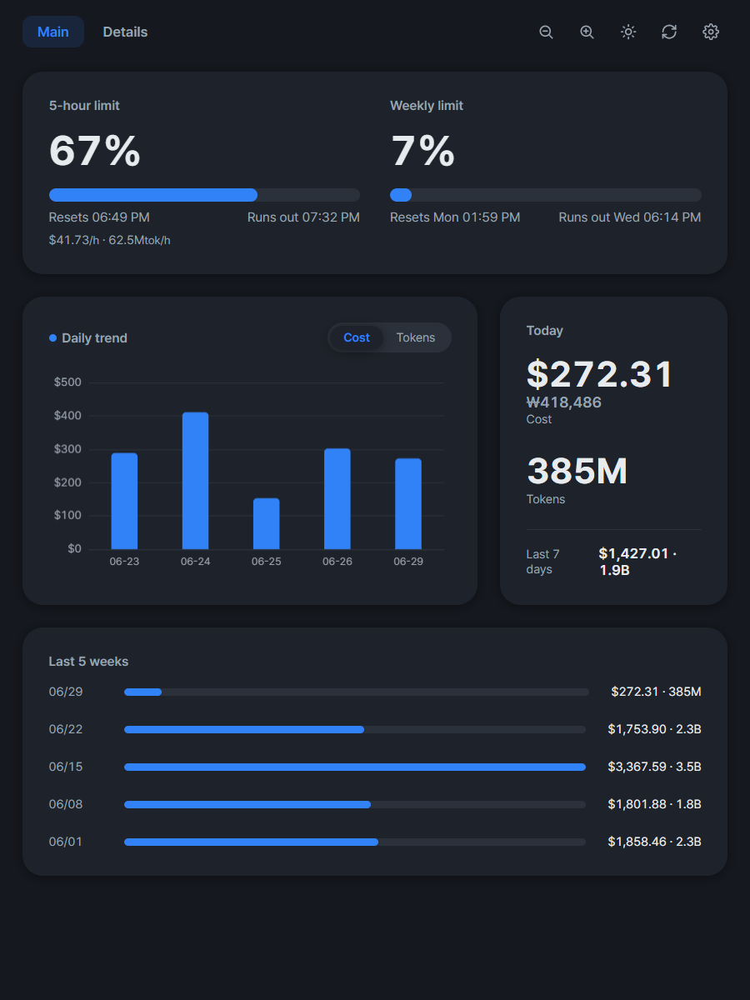
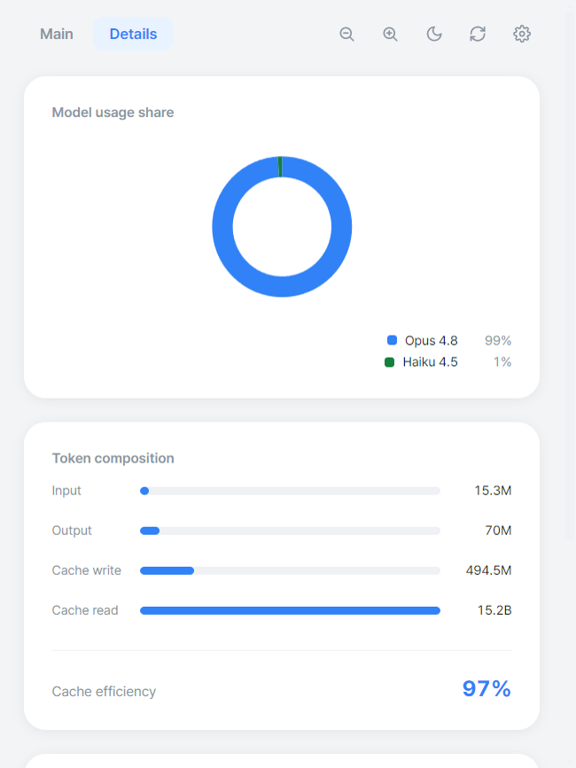
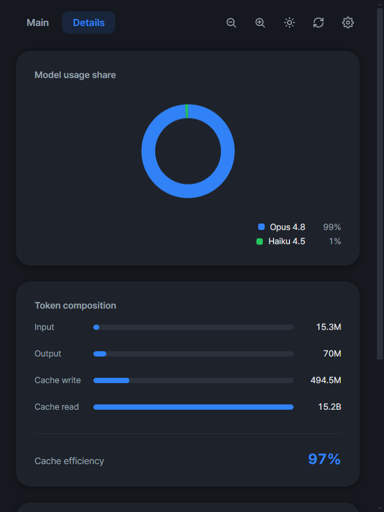
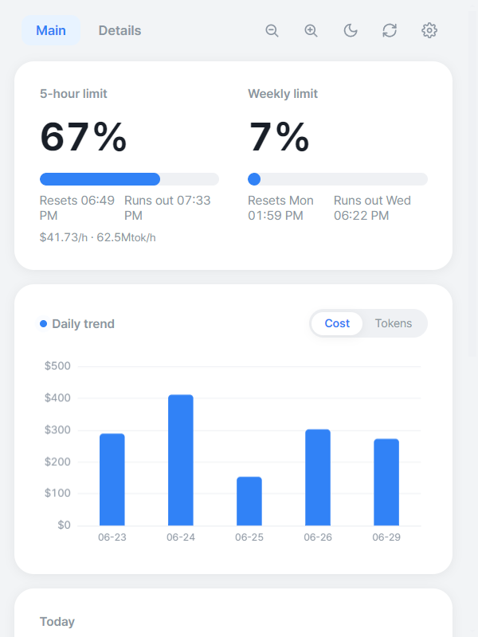

<!-- zh-CN -->
[English](../README.md) | [한국어](README.ko.md) | [Español](README.es.md) | [Português](README.pt-BR.md) | [日本語](README.ja.md) | [Deutsch](README.de.md) | [Français](README.fr.md) | [中文](README.zh-CN.md) | [Italiano](README.it.md) | [Tiếng Việt](README.vi.md)

# Claude Usage

一款常驻托盘的原生桌面应用，**实时可视化你的 [ccusage](https://github.com/ryoppippi/ccusage) 数据**，并**自动生成月度 PDF 报告**。

基于 Electron + ECharts 构建。跨机器、自包含——目标机器无需预装 Node、ccusage 或字体。

<p align="center">
  
</p>

<details>
<summary>更多截图 — 深色主题、详情、响应式布局</summary>

<table>
  <tr>
    <td width="50%"></td>
    <td width="50%"></td>
  </tr>
  <tr>
    <td width="50%"></td>
    <td width="50%"></td>
  </tr>
</table>

</details>

## 功能

- **实时仪表板**（Toss 风格浅色 UI）：活跃 5 小时块的消耗仪表（$/h 与 令牌/h）、每日费用/令牌趋势、模型环形图、今日 KPI 和热门项目。
- **月度 PDF 报告**（4 页）：封面+摘要、每日趋势、明细（模型、令牌构成、缓存效率）、项目与会话。
- **费用与令牌处处同等重要**；USD 旁附 KRW（`$X (₩Y)`）。
- **常驻托盘** + 开机自启；报告于每月 1 日自动生成，并在启动时进行补偿。
- **i18n**：界面支持 10 种语言，按系统区域自动应用。PDF 报告为英文或韩文。

## 安装

从 [Releases](https://github.com/gyeongminn/claude-usage/releases) 页面下载适合你平台的最新版本：

- **Windows**：`ClaudeUsage-<version>-win-x64-setup.exe`（安装程序）或 `...-portable.exe`（免安装）。静默安装：`ClaudeUsage-...-setup.exe /S`。
- **macOS**：`ClaudeUsage-<version>-mac-<arch>.dmg` 或 `.zip`。

### 从源码运行

```sh
npm install
npm start
```

## 开发

```sh
npm test
npm start
npm run shot
```

### 构建与发布

```sh
npm run build
npm run release:patch
```

## 数据来源

所有用量数字均来自 [ccusage](https://github.com/ryoppippi/ccusage) CLI，它读取 `~/.claude/projects/**/*.jsonl`（或 `CLAUDE_CONFIG_DIR`）。费用基于 ccusage 内置单价；KRW 由 USD 按实时汇率（含离线回退）换算。本应用仅做可视化与报告，不重新实现 ccusage 的聚合。

## 许可证

[MIT](../LICENSE) © gyeongmin
